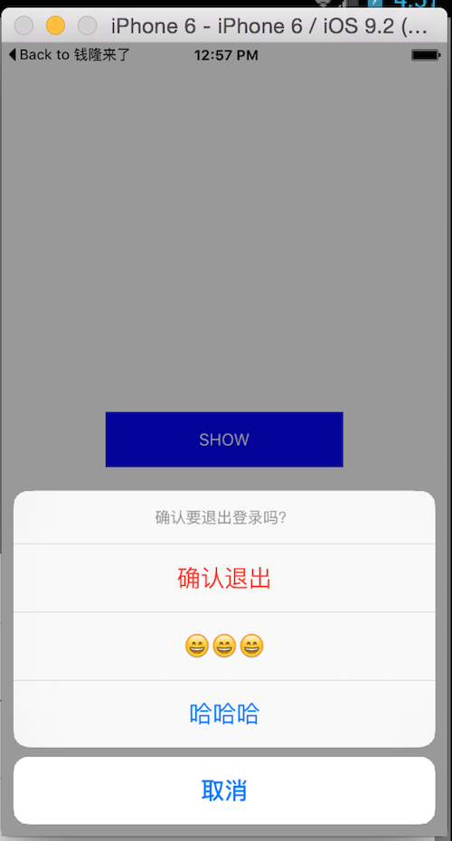
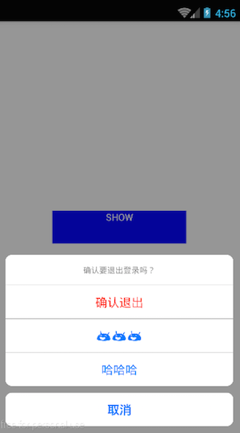

# react-native-actionsheet
Cross platform ActionSheet. This component implements a custom ActionSheet  and provides the same way to drawing it on the defferent platforms(iOS and Android). Actually, In order to keep the best effect, it still uses the ActionSheetIOS on iOS.

 

# Installation

```
npm i react-native-actionsheet --save
```

# Demo

```javascript
/**
 * Sample React Native App
 * https://github.com/facebook/react-native
 */
'use strict';

import React, {
    AppRegistry,
    Component,
    StyleSheet,
    Text,
    View
} from 'react-native';

import ActionSheet from 'react-native-actionsheet';


const buttons = ['取消', '确认退出', '😄😄😄', '哈哈哈'];
const CANCEL_INDEX = 0;
const DESTRUCTIVE_INDEX = 1;


class RNActionSheet extends Component {

    _handlePress(index) {
    }

    show() {
        this.ActionSheet.show();
    }

    render() {
        return (
            <View style={{flex: 1, alignItems: 'center', justifyContent: 'center'}}>
                <Text style={styles.button} onPress={this.show.bind(this)}>SHOW</Text>

                <ActionSheet 
                    ref={(o) => this.ActionSheet = o}
                    title="确认要退出登录吗？"
                    options={buttons}
                    cancelButtonIndex={CANCEL_INDEX}
                    destructiveButtonIndex={DESTRUCTIVE_INDEX}
                    onPress={this._handlePress.bind(this)}
                />
            </View>
        );
    }
}


const styles = StyleSheet.create({
    button: {
        width: 200,
        margin: 10,
        paddingTop: 15,
        paddingBottom: 15,
        color: '#fff',
        textAlign: 'center',
        backgroundColor: 'blue'
    }
});

AppRegistry.registerComponent('RNActionSheet', () => RNActionSheet);
```

## 直接使用自定义的ActionSheet，统一双平台的样式

```js
import {ActionSheetCustom as ActionSheet} from 'react-native-actionsheet';
```

# Props

<table>
    <tr>
        <th>Prop name</th>
        <th>Desciption</th>
        <th>Type</th>
        <th>Default</th>
    </tr>
    <tr>
        <td>title</td>
        <td></td>
        <td>string</td>
        <td></td>
    </tr>
    <tr>
        <td>options</td>
        <td></td>
        <td>string</td>
        <td></td>
    </tr>
    <tr>
        <td>tintColor</td>
        <td></td>
        <td>string</td>
        <td></td>
    </tr>
    <tr>
        <td>cancelButtonIndex</td>
        <td></td>
        <td>string</td>
        <td></td>
    </tr>
    <tr>
        <td>destructiveButtonIndex</td>
        <td></td>
        <td>string</td>
        <td></td>
    </tr>
    <tr>
        <td>onPress</td>
        <td></td>
        <td>function</td>
        <td>(index) => {}</td>
    </tr>
</table>
